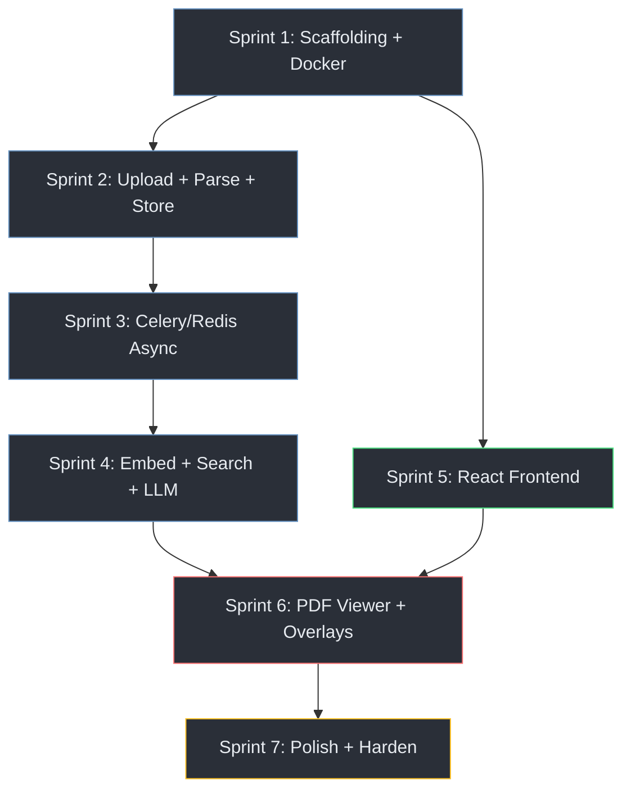

# Lean OmniParse — Executable Implementation Plan

> **Goal:** Build the full Spatial Metadata RAG platform end-to-end, ordered so each sprint delivers a working, demoable increment. High-impact / low-effort work is front-loaded.

---

## Prioritization Strategy

Each sprint is scored on two axes and executed in descending order of **Impact ÷ Effort**:

| Sprint | Deliverable | Impact | Effort | Ratio | Cumulative Demo |
|--------|-------------|--------|--------|-------|-----------------|
| **1** | Project scaffolding + Docker infra | 🔴 Foundational | ⬜ Low | ∞ (enabler) | `docker compose up` boots all services |
| **2** | Upload → pdfplumber → MongoDB pipeline (sync) | 🔴 Core differentiator | 🟡 Medium | Very High | Upload PDF, see chunks + coordinates in MongoDB |
| **3** | Celery / Redis async queue | 🔴 Scalability proof | 🟡 Medium | Very High | Upload returns 202 instantly, worker processes in background |
| **4** | Embeddings + Vector Search + LLM answers | 🔴 Makes it useful | 🟡 Medium | Very High | Ask a question, get a grounded answer with citations |
| **5** | React frontend: dual-pane layout + upload + chat | 🟠 User-facing polish | 🟠 High | High | Full UI with dark theme, upload zone, chat pane |
| **6** | PDF viewer + bounding-box overlays | 🔴 The killer feature | 🟡 Medium | Very High | Click a citation → PDF scrolls, highlight fades in |
| **7** | Animations, error states, production hardening | 🟡 Professional finish | 🟡 Medium | Medium | Feels like enterprise software |

---

## Decisions (Locked)

| Decision | Resolution |
|----------|-----------|
| **File storage** | Local disk with Docker volume (`UPLOAD_DIR`). No S3 abstraction — premature optimization. |
| **MongoDB** | Local MongoDB container in `docker-compose.yml` at `mongodb://mongo:27017`. Client-side vector similarity using `numpy` since `$vectorSearch` is Atlas-exclusive. |
| **Embeddings** | `sentence-transformers/all-MiniLM-L6-v2` (384 dimensions, runs locally, no API key). Gemini API used for LLM generation (`gemini-2.0-flash`). |
| **Tailwind** | **v3** — stable with react-pdf and framer-motion. |
| **PDF scope** | Text-based PDFs only. No OCR / scanned PDF support in v1. |

---

## Dependency Graph



> **Note:** Sprint 5 (React frontend) can start in parallel with Sprints 2–4 since it only depends on Sprint 1's scaffolding. This is the primary parallelization opportunity.

---

## Sprint 1 — Project Scaffolding + Docker Infrastructure

**Goal:** One command (`docker compose up`) boots FastAPI, Redis, MongoDB, and Celery. All services can communicate.

**Effort:** ~1–2 hours | **Impact:** Enables every subsequent sprint

---

### Proposed Changes

#### Backend

##### [NEW] [docker-compose.yml](file:///Users/ayushmali/Documents/OmniParse/docker-compose.yml)
- Services: `api` (FastAPI/uvicorn), `worker` (Celery), `redis` (Redis 7), `mongo` (MongoDB 7)
- Shared network, volume mounts for uploads directory, `.env` file injection

##### [NEW] [backend/requirements.txt](file:///Users/ayushmali/Documents/OmniParse/backend/requirements.txt)
- Core: `fastapi`, `uvicorn[standard]`, `python-multipart`, `aiofiles`
- Database: `motor` (async MongoDB driver), `pymongo`
- Queue: `celery[redis]`, `redis`
- Parsing: `pdfplumber`
- AI: `google-genai`, `sentence-transformers`
- Utilities: `python-slugify`, `pydantic-settings`, `python-dotenv`

##### [NEW] [backend/app/main.py](file:///Users/ayushmali/Documents/OmniParse/backend/app/main.py)
- FastAPI app factory with CORS middleware (allow React dev server origin)
- Include routers (empty stubs for now)
- `/api/v1/health` endpoint returning `{"status": "ok", "redis": "connected", "mongodb": "connected"}`

##### [NEW] [backend/app/config.py](file:///Users/ayushmali/Documents/OmniParse/backend/app/config.py)
- Pydantic `Settings` class loading from `.env`:
  - `MONGODB_URI`, `MONGODB_DB_NAME`
  - `REDIS_URL`
  - `GEMINI_API_KEY`
  - `UPLOAD_DIR`, `MAX_FILE_SIZE_MB`

##### [NEW] [backend/app/database.py](file:///Users/ayushmali/Documents/OmniParse/backend/app/database.py)
- `motor.motor_asyncio.AsyncIOMotorClient` singleton for FastAPI (async)
- `pymongo.MongoClient` singleton for Celery workers (sync)
- Database and collection references

##### [NEW] [backend/app/worker/celery_app.py](file:///Users/ayushmali/Documents/OmniParse/backend/app/worker/celery_app.py)
- Celery app configured with Redis broker URL
- Task autodiscovery from `app.worker.tasks`
- `acks_late=True`, `reject_on_worker_lost=True` defaults

##### [NEW] [backend/Dockerfile](file:///Users/ayushmali/Documents/OmniParse/backend/Dockerfile)
- Python 3.11-slim base, install requirements, copy app

##### [NEW] [.env.example](file:///Users/ayushmali/Documents/OmniParse/.env.example)
- Template with all required environment variables

#### Frontend

##### [NEW] Frontend via `npx create-vite`
- React + TypeScript template
- Install Tailwind CSS, react-pdf, framer-motion
- Verify `npm run dev` serves the default page

---

### Verification

- `docker compose up --build` completes without errors
- `curl http://localhost:8000/api/v1/health` returns `{"status": "ok", ...}`
- `npm run dev` in `frontend/` opens in browser
- Celery worker logs show "ready" and can reach Redis

---

## Sprint 2 — Upload → Parse → Store (Synchronous First)

**Goal:** Upload a PDF via API, extract text + bounding boxes with `pdfplumber`, store chunks in MongoDB. Verify coordinates are correct by inspecting the database.

**Effort:** ~2–3 hours | **Impact:** 🔴 Core differentiator is working

> [!TIP]
> We build this **synchronously first** (blocking the request) to validate the parsing logic in isolation. Sprint 3 will lift it into Celery. This avoids debugging parsing bugs *and* queue bugs simultaneously.

---

### Proposed Changes

##### [NEW] [backend/app/routers/documents.py](file:///Users/ayushmali/Documents/OmniParse/backend/app/routers/documents.py)
- `POST /api/v1/documents/upload` — accepts `multipart/form-data`
  - Validates MIME type (`application/pdf`) and file size
  - Saves PDF to `UPLOAD_DIR/{task_id}.pdf`
  - Calls `extract_chunks_with_coordinates()` synchronously
  - Inserts chunks into `document_chunks` collection
  - Creates task record in `ingestion_tasks` with `status: "completed"`
  - Returns `{task_id, document_id, status, chunk_count}`

##### [NEW] [backend/app/routers/tasks.py](file:///Users/ayushmali/Documents/OmniParse/backend/app/routers/tasks.py)
- `GET /api/v1/tasks/{task_id}/status` — reads task record from MongoDB

##### [NEW] [backend/app/services/parser.py](file:///Users/ayushmali/Documents/OmniParse/backend/app/services/parser.py)
- `extract_chunks_with_coordinates(file_path, document_id) -> list[dict]`
- Dual-pass extraction: tables first (via `page.find_tables()`), then paragraph text
- For each chunk: `document_id`, `page_number`, `page_dimensions`, `chunk_text`, `chunk_type`, `spatial_coordinates: {x0, y0, x1, y1}`, `created_at`
- Helper: `_group_words_into_paragraphs()` — clusters words by vertical proximity
- Helper: `_word_in_any_table()` — filters words inside table bounding boxes

##### [NEW] [backend/app/schemas/document.py](file:///Users/ayushmali/Documents/OmniParse/backend/app/schemas/document.py)
- Pydantic models: `UploadResponse`, `ChunkOut`, `SpatialCoordinates`, `PageDimensions`

##### [NEW] [backend/app/schemas/task.py](file:///Users/ayushmali/Documents/OmniParse/backend/app/schemas/task.py)
- Pydantic models: `TaskStatusResponse`

---

### Verification

- Upload a real multi-page financial PDF (e.g., a 10-K filing)
- Query MongoDB directly:
  ```bash
  mongosh "<ATLAS_URI>" --eval 'db.document_chunks.find({document_id: "test"}).limit(3).pretty()'
  ```
- Confirm each chunk has non-null `spatial_coordinates` with reasonable values
- Confirm `page_dimensions` is present (e.g., `{width: 612, height: 792}` for US Letter)
- Confirm table cells are extracted as separate chunks with `chunk_type: "table_cell"`

---

## Sprint 3 — Celery / Redis Async Pipeline

**Goal:** Move the parsing work from the API thread into a Celery background worker. The upload endpoint returns `HTTP 202` instantly.

**Effort:** ~1–2 hours | **Impact:** 🔴 Proves distributed computing capability

---

### Proposed Changes

##### [MODIFY] [documents.py](file:///Users/ayushmali/Documents/OmniParse/backend/app/routers/documents.py)
- Remove synchronous parsing call
- After saving file + creating task record → `process_document.delay(task_id, file_path, document_id)`
- Return `HTTP 202 Accepted` with `{task_id, document_id, status: "pending"}`

##### [NEW] [backend/app/worker/tasks.py](file:///Users/ayushmali/Documents/OmniParse/backend/app/worker/tasks.py)
- `@celery_app.task(bind=True, max_retries=3, acks_late=True)`
- `def process_document(self, task_id, file_path, document_id):`
  - Updates status to `"processing"`
  - Calls `extract_chunks_with_coordinates()` (from `services/parser.py`)
  - Calls `generate_embeddings_batch()` (stubbed for now — Sprint 4 makes it real)
  - Bulk inserts chunks via `insert_many(ordered=False)`
  - Updates status to `"completed"` with `chunk_count`
  - On exception: updates status to `"failed"`, logs error, retries

---

### Verification

- Upload a PDF: API responds in < 100ms with `202 Accepted`
- Celery worker logs show task pickup and processing
- Poll `GET /tasks/{task_id}/status` — observe transition: `pending → processing → completed`
- MongoDB `document_chunks` collection is populated after worker finishes

---

## Sprint 4 — Embeddings + Vector Search + LLM Generation

**Goal:** The system can answer natural-language questions about an uploaded document, with citation metadata.

**Effort:** ~2–3 hours | **Impact:** 🔴 The system is now *useful*

---

### Proposed Changes

##### [NEW] [backend/app/services/embeddings.py](file:///Users/ayushmali/Documents/OmniParse/backend/app/services/embeddings.py)
- `generate_embeddings_batch(chunks: list[dict]) -> list[dict]`
- Calls OpenAI `text-embedding-3-small` with `dimensions=1536`
- Batches in groups of 64
- Enriches each chunk dict with `embedding_vector: list[float]`

##### [NEW] [backend/app/services/vector_search.py](file:///Users/ayushmali/Documents/OmniParse/backend/app/services/vector_search.py)
- `async exact_knn_search(document_id, query_vector, top_k=5) -> list[dict]`
- Fetches all chunks for `document_id` from MongoDB
- Computes exact Cosine Similarity in-memory using `numpy`
- Sorts and returns top K chunks, omitting the heavy embedding array

##### [NEW] [backend/app/services/llm.py](file:///Users/ayushmali/Documents/OmniParse/backend/app/services/llm.py)
- `async generate_answer(question, chunks) -> dict`
- Assembles numbered context block from retrieved chunks
- Sends to `gemini-2.0-flash` via `google-genai` SDK with strict system prompt (cite sources, no fabrication)
- Returns `{answer, citations: [{source_index, page_number, page_dimensions, bounding_box, chunk_text, chunk_type, relevance_score}]}`

##### [MODIFY] [documents.py](file:///Users/ayushmali/Documents/OmniParse/backend/app/routers/documents.py)
- Add `POST /api/v1/documents/{document_id}/query`
  - Accepts `{question: string}`
  - Vectorizes question locally → `exact_knn_search` → LLM generation → return payload

##### [MODIFY] [tasks.py](file:///Users/ayushmali/Documents/OmniParse/backend/app/worker/tasks.py)
- Replace embedding stub with real `generate_embeddings_batch()` call

##### Local MongoDB Indexes
- Ensure standard B-tree index on `document_id` for fast retrieval of chunks.

---

### Verification

- Upload a PDF, wait for processing to complete
- Query via curl:
  ```bash
  curl -X POST http://localhost:8000/api/v1/documents/test-doc/query \
    -H "Content-Type: application/json" \
    -d '{"question": "What were the total operating expenses?"}'
  ```
- Confirm response contains:
  - A natural-language `answer` with `[Source N]` citations
  - A `citations` array with `page_number`, `bounding_box`, and `relevance_score`
- Confirm `bounding_box` values match what's in MongoDB

---

## Sprint 5 — React Frontend: Layout, Upload, Chat

**Goal:** A polished dark-mode dual-pane UI with upload drag-and-drop, processing status, and chat interface. No PDF viewer yet (that's Sprint 6).

**Effort:** ~3–4 hours | **Impact:** 🟠 The system has a face

> [!NOTE]
> This sprint can be developed **in parallel** with Sprints 2–4 using mocked API responses.

---

### Proposed Changes

##### [NEW] [frontend/src/index.css](file:///Users/ayushmali/Documents/OmniParse/frontend/src/index.css)
- Tailwind directives + CSS custom properties for the dark charcoal / bluish-grey palette
- `--bg-primary: #1a1d23`, `--accent-primary: #6390bf`, etc.
- Custom scrollbar styling, global typography (Inter from Google Fonts)

##### [NEW] [frontend/tailwind.config.js](file:///Users/ayushmali/Documents/OmniParse/frontend/tailwind.config.js)
- Extend theme with custom color tokens matching CSS variables
- Dark mode: `class` strategy

##### [NEW] [frontend/src/types/api.ts](file:///Users/ayushmali/Documents/OmniParse/frontend/src/types/api.ts)
- TypeScript interfaces: `Citation`, `QueryResponse`, `TaskStatus`, `UploadResponse`

##### [NEW] [frontend/src/components/UploadZone.tsx](file:///Users/ayushmali/Documents/OmniParse/frontend/src/components/UploadZone.tsx)
- Drag-and-drop zone with `react-dropzone` or native HTML5 drag events
- File type validation (PDF only), size display
- Upload progress bar, animated file icon
- On success: transitions to processing state

##### [NEW] [frontend/src/components/StatusIndicator.tsx](file:///Users/ayushmali/Documents/OmniParse/frontend/src/components/StatusIndicator.tsx)
- Polls `GET /tasks/{task_id}/status` every 2 seconds
- Animated status badges: ⏳ Pending (amber pulse), ⚙️ Processing (blue spin), ✅ Completed (green), ❌ Failed (red)
- On `completed`: auto-transitions to the query view

##### [NEW] [frontend/src/components/ChatPane.tsx](file:///Users/ayushmali/Documents/OmniParse/frontend/src/components/ChatPane.tsx)
- Chat-style message list (user bubbles right-aligned, AI bubbles left-aligned)
- Input bar at bottom with send button
- AI responses render markdown with clickable `[Source N]` citation badges
- Typing indicator animation while waiting for API

##### [NEW] [frontend/src/components/CitationBadge.tsx](file:///Users/ayushmali/Documents/OmniParse/frontend/src/components/CitationBadge.tsx)
- Small pill-shaped badge: `📎 Source 1 · Page 14`
- Clickable — emits `onCitationClick(citation)` to parent
- Hover tooltip shows `chunk_text` preview

##### [NEW] [frontend/src/hooks/useDocumentQuery.ts](file:///Users/ayushmali/Documents/OmniParse/frontend/src/hooks/useDocumentQuery.ts)
- Manages query state, loading, error handling
- Calls `POST /documents/{id}/query`

##### [NEW] [frontend/src/hooks/useTaskPolling.ts](file:///Users/ayushmali/Documents/OmniParse/frontend/src/hooks/useTaskPolling.ts)
- Polls task status with `setInterval` (2s), auto-clears on completion/failure

##### [MODIFY] [frontend/src/App.tsx](file:///Users/ayushmali/Documents/OmniParse/frontend/src/App.tsx)
- Three-state view:
  1. **Upload state** → `<UploadZone />`
  2. **Processing state** → `<StatusIndicator />`
  3. **Query state** → Split pane: `<ChatPane />` (left 40%) + placeholder (right 60%)

---

### Verification

- `npm run dev` opens the app in browser
- Dark-mode UI renders correctly with the charcoal/bluish-grey palette
- Drag a PDF → upload progress → processing animation → chat view transition
- Type a question → AI response appears with citation badges
- Citation badges are clickable (handler logs to console — Sprint 6 connects to PDF viewer)

---

## Sprint 6 — PDF Viewer + Bounding Box Overlays (The Killer Feature)

**Goal:** The right pane renders the uploaded PDF. Clicking a citation scrolls to the correct page and fades in a colored bounding box over the exact source text.

**Effort:** ~2–3 hours | **Impact:** 🔴 The *entire point* of the project — visual explainability

---

### Proposed Changes

##### [NEW] [frontend/src/components/PDFViewer.tsx](file:///Users/ayushmali/Documents/OmniParse/frontend/src/components/PDFViewer.tsx)
- Uses `react-pdf` `<Document>` and `<Page>` components
- Loads PDF from backend URL (`GET /uploads/{task_id}.pdf` — needs a static file endpoint)
- Page navigation controls (prev / next / jump-to-page)
- `onRenderSuccess` callback captures rendered canvas dimensions

##### [NEW] [frontend/src/components/BoundingBoxOverlay.tsx](file:///Users/ayushmali/Documents/OmniParse/frontend/src/components/BoundingBoxOverlay.tsx)
- Receives `citation` + `scale: {scaleX, scaleY}`
- Computes CSS position: `left = x0 * scaleX`, `top = y0 * scaleY`, etc.
- Renders `<motion.div>` with:
  - `backgroundColor: rgba(99, 144, 191, 0.25)`
  - `border: 2px solid rgba(99, 144, 191, 0.7)`
  - `framer-motion` fade-in + subtle scale animation (400ms)
- `pointerEvents: "none"` so it doesn't block PDF text selection

##### [NEW] [frontend/src/hooks/usePageScale.ts](file:///Users/ayushmali/Documents/OmniParse/frontend/src/hooks/usePageScale.ts)
- Computes `scaleX = renderedWidth / page_dimensions.width`
- Computes `scaleY = renderedHeight / page_dimensions.height`
- Recomputes on window resize via `ResizeObserver`

##### [MODIFY] [frontend/src/App.tsx](file:///Users/ayushmali/Documents/OmniParse/frontend/src/App.tsx)
- Replace right-pane placeholder with `<PDFViewer />`
- Wire `onCitationClick` from `ChatPane` → `PDFViewer`:
  - Sets active page number → PDF viewer scrolls
  - Sets active citation → bounding box overlay renders

##### [MODIFY] [backend/app/main.py](file:///Users/ayushmali/Documents/OmniParse/backend/app/main.py)
- Mount `UPLOAD_DIR` as a static files directory so the frontend can fetch PDFs:
  ```python
  app.mount("/uploads", StaticFiles(directory=UPLOAD_DIR), name="uploads")
  ```

---

### The Coordinate Mapping Algorithm (recap)

```
┌─────────────────────────────────────────────────────────────────┐
│  PDF Native Space (pdfplumber)     Canvas Pixel Space (react-pdf)│
│                                                                   │
│  (x0=120.5, y0=450.2)             (left=180.7, top=675.3)       │
│       ┌──────────┐                      ┌──────────┐             │
│       │ $45,200  │  ──── × scale ────►  │ $45,200  │             │
│       └──────────┘                      └──────────┘             │
│  (x1=300.0, y1=465.8)             (width=269.2, height=23.4)    │
│                                                                   │
│  scale = renderedWidth / pdfWidth = e.g., 1.5×                   │
└─────────────────────────────────────────────────────────────────┘
```

---

### Verification

- Upload a PDF → process → ask a question
- Click `[Source 1]` citation → PDF viewer jumps to correct page
- A semi-transparent blue-grey box appears over the exact text region
- Box animates in smoothly (framer-motion fade + scale)
- Resize the browser window → box repositions correctly
- Click a different citation → previous box fades out, new box fades in on new page

---

## Sprint 7 — Animation Polish, Error Handling, Production Hardening

**Goal:** The application feels like enterprise-grade software. All error states are handled gracefully. Docker compose runs the full stack in production mode.

**Effort:** ~2–3 hours | **Impact:** 🟡 Professional finish

---

### Proposed Changes

#### Frontend Polish

##### [MODIFY] Multiple frontend components
- **Chat typing indicator:** Three-dot bounce animation while waiting for LLM response
- **Message transitions:** `framer-motion` `AnimatePresence` for chat message entries
- **Citation hover tooltip:** Shows `chunk_text` preview + relevance score percentage
- **Upload drag hover:** Border glow effect + file icon animation when dragging over upload zone
- **Error states:**
  - Upload failure → red toast with retry button
  - Processing failure → error card with `error_log` from API
  - Query failure → inline error message with retry
  - Network timeout → "Connection lost" banner
- **Empty states:** Elegant placeholder when no document is loaded
- **Loading skeletons:** Pulsing placeholder blocks in chat pane during query

#### Backend Hardening

##### [NEW] [backend/app/middleware.py](file:///Users/ayushmali/Documents/OmniParse/backend/app/middleware.py)
- Request logging middleware (method, path, status code, latency)
- Rate limiting via `slowapi` (10 uploads/min per IP, 30 queries/min per IP)

##### [MODIFY] [backend/app/routers/documents.py](file:///Users/ayushmali/Documents/OmniParse/backend/app/routers/documents.py)
- Add `DELETE /api/v1/documents/{document_id}`:
  - Deletes all chunks from `document_chunks`
  - Deletes task record from `ingestion_tasks`
  - Deletes PDF file from disk
  - Returns `204 No Content`
- Add `GET /api/v1/documents/{document_id}/pages/{page_number}/chunks`:
  - Returns all chunks for a specific page (useful for pre-rendering overlays)

##### [MODIFY] [docker-compose.yml](file:///Users/ayushmali/Documents/OmniParse/docker-compose.yml)
- Add production-ready configuration:
  - Redis persistence (AOF)
  - MongoDB volume mount for data persistence
  - Health checks on all services
  - Restart policies (`unless-stopped`)
  - Frontend built and served via nginx container

---

### Verification

- **End-to-end happy path:** Upload → Process → Query → See highlighted source on PDF
- **Error recovery:** Kill Celery worker mid-task → restart → task auto-retries and completes
- **Rate limiting:** Rapid-fire uploads → receive HTTP 429 after threshold
- **Cleanup:** Delete a document → confirm chunks and task are removed from MongoDB
- **Responsive:** Resize browser from 1920px to 1024px → layout adapts, overlays reposition
- **Full Docker:** `docker compose -f docker-compose.yml up --build` boots all services, frontend accessible at `http://localhost:3000`

---

## Summary: Estimated Total Effort

| Sprint | Estimated Time | Cumulative |
|--------|---------------|------------|
| Sprint 1: Scaffolding | 1–2 hours | 1–2 hours |
| Sprint 2: Parse Pipeline | 2–3 hours | 3–5 hours |
| Sprint 3: Async Queue | 1–2 hours | 4–7 hours |
| Sprint 4: AI Intelligence | 2–3 hours | 6–10 hours |
| Sprint 5: React Frontend | 3–4 hours | 9–14 hours |
| Sprint 6: PDF + Overlays | 2–3 hours | 11–17 hours |
| Sprint 7: Polish + Harden | 2–3 hours | 13–20 hours |
| **Total** | **13–20 hours** | — |

> [!TIP]
> **Parallelization opportunity:** If a second developer is available, Sprints 2–4 (backend) and Sprint 5 (frontend) can run concurrently, reducing wall-clock time to **~10–14 hours**.

---

## User Review Required

> [!IMPORTANT]
> Please review the following before I begin execution:
>
> 1. **Local MongoDB Confirmed:** We are using a local MongoDB container instead of Atlas.
> 2. **Do you have a Gemini API key** from Google AI Studio, or should I implement a placeholder LLM for initial development?
> 3. **Should I use Tailwind CSS v3 or v4?** (The architecture doc specifies Tailwind — v4 is the latest but v3 is more battle-tested with existing React component libraries.)
> 4. **Approve the sprint ordering** — or would you like me to resequence anything?
