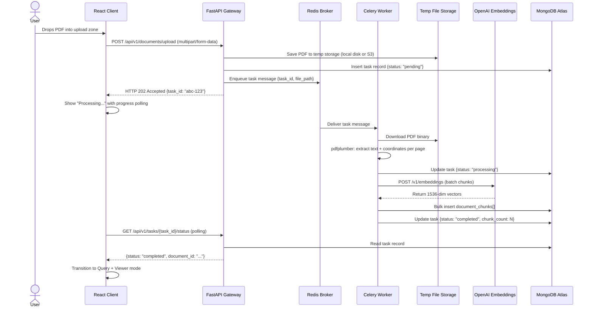
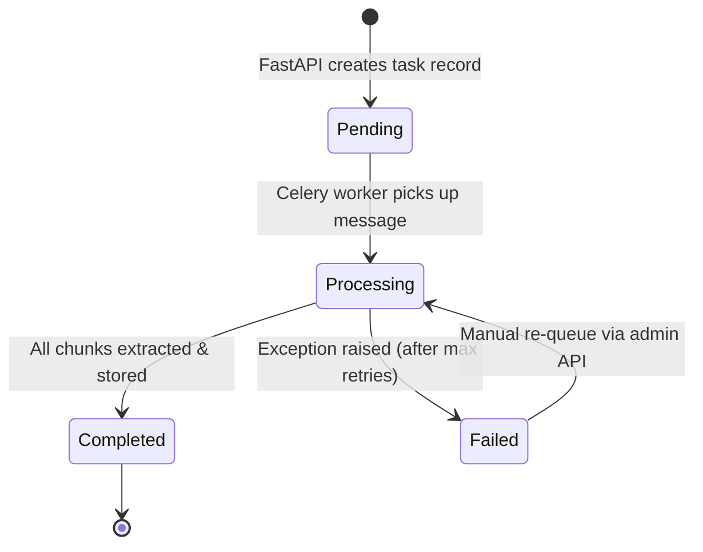

# Lean OmniParse — System Architecture Design Document

> **Project:** Lean OmniParse: A Distributed Multimodal RAG Platform with Spatial Metadata Extraction
> **Classification:** Internal Engineering — Production Architecture Specification
> **Revision:** 1.0.0 · June 2026
> **Author Role:** Principal Systems Architect / Senior AI Engineer

---

## Table of Contents

1. [Executive Architectural Summary](#1-executive-architectural-summary)
2. [Distributed Data Ingestion Lifecycle & Sequence](#2-distributed-data-ingestion-lifecycle--sequence)
3. [Data Retrieval & Retrofitted Generation Pipeline](#3-data-retrieval--retrofitted-generation-pipeline)
4. [Schemas & Database Architecture](#4-schemas--database-architecture)
5. [Dispatch & Coordinate Mapping Frontend Protocol](#5-dispatch--coordinate-mapping-frontend-protocol)
6. [Appendices](#6-appendices)

---

## 1. Executive Architectural Summary

### 1.1 The Spatial Metadata RAG Paradigm

Standard Retrieval-Augmented Generation (RAG) pipelines ingest documents through a **deterministic text-flattening** pass: the parser strips the PDF into a monolithic string, discards all positional metadata, and feeds the result into an embedding model. The downstream consequence is catastrophic for high-stakes domains — financial auditing, legal discovery, regulatory compliance — where an analyst must *verify provenance* of every cited figure. The LLM produces an answer, but the user has no mechanism to trace that answer to a physical region of the source document. The result is an opaque "black-box" that erodes trust and, in regulated environments, renders the system non-compliant.

**Lean OmniParse eliminates this failure mode by treating spatial coordinates as first-class citizens of the extraction pipeline.** Every text fragment — whether a paragraph body, a table cell, or a header — is extracted alongside its pixel-precise `[x0, y0, x1, y1]` bounding box via `pdfplumber`. These coordinates are persisted in MongoDB Atlas as nested sub-documents, co-located with the chunk text and its 1536-dimensional embedding vector. At query time, the platform retrieves the semantically relevant chunk, generates a natural-language answer through a lightweight LLM, and returns the **exact page number and bounding rectangle** to the frontend. The React dual-pane UI then renders a translucent highlight overlay directly atop the original PDF canvas, creating a visual audit trail that is deterministic, verifiable, and tamper-evident.

This paradigm — **Spatial Metadata RAG** — converts the system from an unverifiable generative chatbot into a defensible, explainable intelligence tool.

### 1.2 Eliminating LLM Hallucinations via Grounded Retrieval

Hallucination in financial RAG systems stems from two root causes:

| Root Cause | Standard RAG Behavior | Lean OmniParse Mitigation |
|---|---|---|
| **Context starvation** | Chunking destroys table structure; the LLM receives partial data and fabricates the remainder. | `pdfplumber` preserves table-cell boundaries. Each cell is an individually addressable chunk with intact numeric precision. |
| **Provenance opacity** | The user cannot distinguish a hallucinated figure from a retrieved one because no source link exists. | Every answer carries a `citations[]` payload with page numbers and pixel coordinates. The user visually confirms the source on the original PDF. |

The architecture does not attempt to make the LLM "more accurate" — it makes hallucinations **immediately detectable** by the human operator through spatial grounding.

### 1.3 Performance Decoupling Strategy

The single most critical architectural decision is the **complete separation of the synchronous API request/response cycle from compute-heavy parsing operations**. This is achieved through a three-tier decoupling stack:

```
┌─────────────────────────────────────────────────────────────────────┐
│                        CLIENT TIER                                  │
│  React + Vite + react-pdf + framer-motion                           │
│  ► Receives HTTP 202 immediately                                    │
│  ► Polls /tasks/{id}/status or subscribes via WebSocket             │
└──────────────────────────┬──────────────────────────────────────────┘
                           │ HTTP / WebSocket
┌──────────────────────────▼──────────────────────────────────────────┐
│                      API GATEWAY TIER                                │
│  FastAPI (uvicorn, async event loop)                                │
│  ► Validates upload payload                                         │
│  ► Writes task record to MongoDB (status: "pending")                │
│  ► Publishes task message to Redis                                  │
│  ► Returns 202 Accepted { task_id } in < 50ms                      │
│  ► Handles query vectorization + $vectorSearch + LLM generation     │
└──────────────────────────┬──────────────────────────────────────────┘
                           │ Redis Pub/Sub (AMQP-like)
┌──────────────────────────▼──────────────────────────────────────────┐
│                     WORKER TIER                                      │
│  Celery Workers (1–N horizontally scalable processes)               │
│  ► Consumes task messages from Redis                                │
│  ► Downloads PDF from temp storage                                  │
│  ► Runs pdfplumber extraction (CPU-bound)                           │
│  ► Calls OpenAI Embedding API (I/O-bound)                           │
│  ► Bulk-inserts chunks into MongoDB Atlas                           │
│  ► Updates task status to "completed" or "failed"                   │
└─────────────────────────────────────────────────────────────────────┘
```

**Why this matters:** A 200-page financial 10-K filing can take 30–90 seconds to parse and embed. Without decoupling, the FastAPI event loop would block for that entire duration, starving all other inbound requests. With the queue architecture, FastAPI's median response latency remains **< 50 ms** regardless of document size or concurrent upload volume. Celery workers can be scaled horizontally — adding more worker processes or machines linearly increases throughput without touching the API layer.

> [!IMPORTANT]
> The API Gateway tier is **stateless** with respect to document processing. It knows nothing about `pdfplumber`, embedding models, or chunk logic. It is purely a routing and query-serving layer. This clean separation enables independent scaling, deployment, and failure isolation.

### 1.4 Technology Stack Justification

| Component | Technology | Selection Rationale |
|---|---|---|
| **API Gateway** | FastAPI (Python 3.11+, uvicorn) | Native `async/await` support; automatic OpenAPI schema generation; Pydantic-based request validation; sub-millisecond routing overhead. |
| **Message Broker** | Redis 7.x | Single-digit microsecond latency for queue operations; persistence via AOF for crash recovery; mature Celery integration via `redis://` transport. |
| **Background Workers** | Celery 5.x | Battle-tested distributed task framework; supports task retry policies, rate limiting, priority queues, and dead-letter routing. |
| **Database + Vector Engine** | MongoDB Atlas (M10+ tier) | Native `$vectorSearch` operator eliminates the need for a separate vector database (Pinecone, Weaviate); BSON document model natively represents nested spatial coordinates without ORM impedance mismatch; Atlas Search indexes enable hybrid keyword + vector retrieval. |
| **Spatial Parser** | pdfplumber | Pixel-accurate `[x0, y0, x1, y1]` extraction from PDF content streams; superior table detection compared to PyMuPDF for financial documents with complex multi-column layouts. |
| **Frontend** | React 18 (Vite), Tailwind CSS, react-pdf, framer-motion | Vite provides sub-second HMR; react-pdf renders PDF pages as `<canvas>` elements with deterministic pixel scaling; framer-motion enables choreographed bounding-box animations; Tailwind enforces a consistent dark-mode design system. |

---

## 2. Distributed Data Ingestion Lifecycle & Sequence

This section provides a frame-by-frame technical breakdown of the ingestion pipeline, from the moment a user drops a PDF into the upload zone to the final atomic database write.

### 2.1 Sequence Diagram



### 2.2 Stage 1 — FastAPI File Acquisition & Immediate Dispatch

**Entry Point:** `POST /api/v1/documents/upload`

When the React client submits the PDF as a `multipart/form-data` payload, FastAPI executes the following atomic sequence:

#### 2.2.1 File Validation & Persistence

```python
@router.post("/documents/upload", status_code=status.HTTP_202_ACCEPTED)
async def upload_document(
    file: UploadFile = File(...),
    document_name: str = Form(None),
):
    # 1. Validate MIME type and file size ceiling (e.g., 50 MB)
    if file.content_type != "application/pdf":
        raise HTTPException(status_code=422, detail="Only PDF files are accepted.")
    
    if file.size > MAX_FILE_SIZE_BYTES:
        raise HTTPException(status_code=413, detail="File exceeds 50 MB limit.")
    
    # 2. Generate deterministic identifiers
    task_id = str(uuid4())
    document_id = slugify(document_name or file.filename) + f"_{task_id[:8]}"
    
    # 3. Persist the binary to temp storage
    file_path = UPLOAD_DIR / f"{task_id}.pdf"
    async with aiofiles.open(file_path, "wb") as dest:
        content = await file.read()
        await dest.write(content)
    
    # 4. Create the task tracking record in MongoDB
    task_record = {
        "task_id": task_id,
        "document_id": document_id,
        "original_filename": file.filename,
        "file_path": str(file_path),
        "status": "pending",
        "chunk_count": 0,
        "error_log": None,
        "created_at": datetime.utcnow(),
        "updated_at": datetime.utcnow(),
    }
    await db.ingestion_tasks.insert_one(task_record)
    
    # 5. Dispatch to Celery via Redis
    process_document.delay(task_id, str(file_path), document_id)
    
    # 6. Return immediately — the client is free
    return {"task_id": task_id, "document_id": document_id, "status": "pending"}
```

> [!TIP]
> **Latency Target:** The entire `upload_document` handler must complete in **< 100 ms**. The three I/O operations (file write, MongoDB insert, Redis enqueue) are all asynchronous. There is zero CPU-bound work on this thread.

#### 2.2.2 Tracking Endpoint

The client polls for completion status via a lightweight read:

```python
@router.get("/tasks/{task_id}/status")
async def get_task_status(task_id: str):
    task = await db.ingestion_tasks.find_one(
        {"task_id": task_id},
        {"_id": 0, "task_id": 1, "status": 1, "document_id": 1,
         "chunk_count": 1, "error_log": 1, "updated_at": 1}
    )
    if not task:
        raise HTTPException(status_code=404, detail="Task not found.")
    return task
```

**Polling Strategy:** The React client polls every 2 seconds using `setInterval`. For production deployments, this can be upgraded to a WebSocket or Server-Sent Events (SSE) channel to eliminate polling overhead entirely.

### 2.3 Stage 2 — Celery Worker Execution: Spatial Extraction via pdfplumber

**Celery Task Definition:**

The worker is a dedicated Python process (or pool of processes) that runs independently of FastAPI. It monitors the Redis queue and executes the `process_document` task:

```python
@celery_app.task(
    bind=True,
    max_retries=3,
    default_retry_delay=30,
    acks_late=True,              # Acknowledge AFTER completion, not before
    reject_on_worker_lost=True,  # Re-queue if worker crashes mid-task
)
def process_document(self, task_id: str, file_path: str, document_id: str):
    try:
        # Update status to "processing"
        db_sync.ingestion_tasks.update_one(
            {"task_id": task_id},
            {"$set": {"status": "processing", "updated_at": datetime.utcnow()}}
        )
        
        chunks = extract_chunks_with_coordinates(file_path, document_id)
        enriched_chunks = generate_embeddings_batch(chunks)
        
        # Bulk insert all chunks atomically
        if enriched_chunks:
            db_sync.document_chunks.insert_many(enriched_chunks, ordered=False)
        
        # Mark complete
        db_sync.ingestion_tasks.update_one(
            {"task_id": task_id},
            {"$set": {
                "status": "completed",
                "chunk_count": len(enriched_chunks),
                "updated_at": datetime.utcnow(),
            }}
        )
    except Exception as exc:
        db_sync.ingestion_tasks.update_one(
            {"task_id": task_id},
            {"$set": {
                "status": "failed",
                "error_log": str(exc),
                "updated_at": datetime.utcnow(),
            }}
        )
        raise self.retry(exc=exc)
```

> [!WARNING]
> **`acks_late=True`** is critical for reliability. Without it, Redis acknowledges the message *before* the worker finishes processing. If the worker crashes mid-extraction, the task is lost forever. With late acknowledgment, Redis retains the message until the worker explicitly confirms completion.

#### 2.3.1 The pdfplumber Extraction Loop

The spatial extraction logic iterates over every page and extracts text at the word level, then reconstitutes logical chunks (paragraphs and table cells):

```python
def extract_chunks_with_coordinates(file_path: str, document_id: str) -> list[dict]:
    chunks = []
    
    with pdfplumber.open(file_path) as pdf:
        for page_num, page in enumerate(pdf.pages, start=1):
            page_width = page.width
            page_height = page.height
            
            # --- TABLE EXTRACTION ---
            tables = page.find_tables()
            table_bboxes = [table.bbox for table in tables]
            
            for table in tables:
                extracted = table.extract()
                if not extracted:
                    continue
                for row_idx, row in enumerate(extracted):
                    for col_idx, cell in enumerate(row):
                        if cell and cell.strip():
                            # Approximate cell bounding box from table grid
                            cell_bbox = _compute_cell_bbox(
                                table.bbox, table.cells, row_idx, col_idx
                            )
                            chunks.append({
                                "document_id": document_id,
                                "page_number": page_num,
                                "page_dimensions": {
                                    "width": float(page_width),
                                    "height": float(page_height),
                                },
                                "chunk_text": cell.strip(),
                                "chunk_type": "table_cell",
                                "spatial_coordinates": {
                                    "x0": round(cell_bbox[0], 2),
                                    "y0": round(cell_bbox[1], 2),
                                    "x1": round(cell_bbox[2], 2),
                                    "y1": round(cell_bbox[3], 2),
                                },
                                "created_at": datetime.utcnow(),
                            })
            
            # --- PARAGRAPH EXTRACTION ---
            # Extract words, excluding regions already captured as tables
            words = page.extract_words(
                keep_blank_chars=False,
                x_tolerance=3,
                y_tolerance=3,
            )
            
            # Filter out words that fall within table bounding boxes
            non_table_words = [
                w for w in words
                if not _word_in_any_table(w, table_bboxes)
            ]
            
            # Group words into paragraph-level chunks by vertical proximity
            paragraphs = _group_words_into_paragraphs(
                non_table_words, y_gap_threshold=12.0
            )
            
            for para in paragraphs:
                chunks.append({
                    "document_id": document_id,
                    "page_number": page_num,
                    "page_dimensions": {
                        "width": float(page_width),
                        "height": float(page_height),
                    },
                    "chunk_text": para["text"],
                    "chunk_type": "paragraph",
                    "spatial_coordinates": {
                        "x0": round(para["x0"], 2),
                        "y0": round(para["y0"], 2),
                        "x1": round(para["x1"], 2),
                        "y1": round(para["y1"], 2),
                    },
                    "created_at": datetime.utcnow(),
                })
    
    return chunks
```

**Key Design Decisions:**

1. **Dual-pass extraction (tables first, then paragraphs):** Tables in financial PDFs contain the highest-value data (revenue figures, expense breakdowns). Extracting tables first and masking their bounding regions prevents double-counting when the paragraph pass runs.

2. **Word-level granularity with paragraph reconstitution:** `pdfplumber` extracts individual words with precise coordinates. The `_group_words_into_paragraphs` function clusters words by vertical proximity (`y_gap_threshold=12.0` points), computing the union bounding box of all words in the cluster. This produces paragraph-level chunks with tight, accurate spatial envelopes.

3. **Page dimension capture:** The `page_dimensions` field (width × height in PDF points) is persisted with every chunk. The frontend needs these values to compute the scaling ratio between the PDF's native coordinate space and the rendered `<canvas>` pixel dimensions.

### 2.4 Stage 3 — Embedding Generation via OpenAI

After spatial extraction, the worker generates vector embeddings for each chunk. This is an I/O-bound operation (network call to OpenAI's API) and is batched for throughput:

```python
EMBEDDING_MODEL = "text-embedding-3-small"
EMBEDDING_DIMENSIONS = 1536
BATCH_SIZE = 64  # OpenAI allows up to 2048 inputs per request

def generate_embeddings_batch(chunks: list[dict]) -> list[dict]:
    """
    Enriches each chunk dict with an 'embedding_vector' field.
    Batches API calls to minimize round-trip overhead.
    """
    texts = [c["chunk_text"] for c in chunks]
    
    all_embeddings = []
    for i in range(0, len(texts), BATCH_SIZE):
        batch = texts[i : i + BATCH_SIZE]
        response = openai_client.embeddings.create(
            model=EMBEDDING_MODEL,
            input=batch,
            dimensions=EMBEDDING_DIMENSIONS,
        )
        all_embeddings.extend([item.embedding for item in response.data])
    
    for chunk, embedding in zip(chunks, all_embeddings):
        chunk["embedding_vector"] = embedding
    
    return chunks
```

> [!NOTE]
> **Cost Optimization:** `text-embedding-3-small` costs ~$0.02 per 1M tokens. A 200-page 10-K filing typically yields ~2,000 chunks × ~50 tokens/chunk = 100K tokens, costing approximately **$0.002 per document**. At this price point, embedding is negligible relative to compute and storage costs.

**Retry & Rate Limiting:** The OpenAI client is configured with exponential backoff (`max_retries=5`, `timeout=30s`). For burst ingestion scenarios (multiple concurrent documents), the Celery worker's `rate_limit` parameter can be set (e.g., `rate_limit="10/m"`) to stay within OpenAI's TPM (tokens per minute) quota.

### 2.5 Stage 4 — Atomic Insertion into MongoDB Atlas & State Update

The final stage is a bulk write of enriched chunks into the `document_chunks` collection, followed by a status update on the `ingestion_tasks` collection.

#### 2.5.1 Bulk Insert Strategy

```python
# Within the Celery task
if enriched_chunks:
    db_sync.document_chunks.insert_many(enriched_chunks, ordered=False)
```

- **`ordered=False`:** Allows MongoDB to insert documents in parallel rather than sequentially. If one document fails validation, the remaining inserts still proceed. This is critical for throughput on large documents (2,000+ chunks).
- **Write Concern:** The MongoDB client is configured with `w="majority"` to ensure durability across the Atlas replica set before acknowledging the write.

#### 2.5.2 Atlas Vector Search Index Configuration

Before the first query can execute, an Atlas Vector Search index must be created on the `document_chunks` collection. This is a one-time operation performed via the Atlas UI or API:

```json
{
  "name": "vector_index",
  "type": "vectorSearch",
  "definition": {
    "fields": [
      {
        "type": "vector",
        "path": "embedding_vector",
        "numDimensions": 1536,
        "similarity": "cosine"
      },
      {
        "type": "filter",
        "path": "document_id"
      }
    ]
  }
}
```

This index enables sub-100ms approximate nearest neighbor (ANN) searches across millions of vectors, scoped to a specific document via the `document_id` filter.

---

## 3. Data Retrieval & Retrofitted Generation Pipeline

This section details the query flow — from natural-language question to grounded, citation-backed answer.

### 3.1 Query Vectorization

When the user submits a question via the React chat interface, FastAPI converts it into a vector using the same embedding model used during ingestion:

```python
@router.post("/documents/{document_id}/query")
async def query_document(document_id: str, body: QueryRequest):
    question = body.question
    
    # 1. Vectorize the question
    response = openai_client.embeddings.create(
        model="text-embedding-3-small",
        input=question,
        dimensions=1536,
    )
    query_vector = response.data[0].embedding
    
    # 2. Execute Atlas Vector Search
    relevant_chunks = await vector_search(document_id, query_vector, top_k=5)
    
    # 3. Generate LLM answer with citations
    answer_payload = await generate_answer(question, relevant_chunks)
    
    return answer_payload
```

### 3.2 MongoDB Atlas `$vectorSearch` Aggregation Pipeline

The vector search query leverages MongoDB's native `$vectorSearch` stage, which performs approximate nearest neighbor (ANN) retrieval using a Hierarchical Navigable Small World (HNSW) graph index:

```python
async def vector_search(
    document_id: str,
    query_vector: list[float],
    top_k: int = 5,
) -> list[dict]:
    pipeline = [
        {
            "$vectorSearch": {
                "index": "vector_index",
                "path": "embedding_vector",
                "queryVector": query_vector,
                "numCandidates": top_k * 10,  # Over-fetch for precision
                "limit": top_k,
                "filter": {
                    "document_id": document_id
                }
            }
        },
        {
            "$project": {
                "_id": 0,
                "chunk_text": 1,
                "page_number": 1,
                "page_dimensions": 1,
                "spatial_coordinates": 1,
                "chunk_type": 1,
                "score": {"$meta": "vectorSearchScore"},
            }
        }
    ]
    
    cursor = db.document_chunks.aggregate(pipeline)
    results = await cursor.to_list(length=top_k)
    return results
```

**Parameter Tuning:**

| Parameter | Value | Rationale |
|---|---|---|
| `numCandidates` | `top_k × 10` (50) | The HNSW index examines 50 candidates to return the top 5. Higher ratios improve recall at the cost of latency. A 10× multiplier is the recommended starting point for financial document retrieval. |
| `limit` | 5 | Returns the 5 most semantically similar chunks. For financial queries, 3–5 chunks typically capture the full context (e.g., the relevant table row + surrounding paragraph). |
| `filter.document_id` | Exact match | Scopes the search to a single document, preventing cross-document contamination. This filter is pushed down into the ANN index, not applied post-search. |
| `similarity` | Cosine | Cosine similarity is the standard metric for OpenAI embeddings, which are already L2-normalized. |

> [!IMPORTANT]
> **`numCandidates` must be ≥ `limit`** and ≤ 10,000. Setting `numCandidates` too low causes recall degradation (relevant chunks are missed). Setting it too high degrades latency. The `top_k × 10` heuristic balances both dimensions for document-scoped searches.

### 3.3 Context Injection & LLM Generation

The retrieved chunks are assembled into a structured prompt and passed to a lightweight LLM for answer synthesis:

```python
async def generate_answer(question: str, chunks: list[dict]) -> dict:
    # Build context block with chunk attribution
    context_parts = []
    for i, chunk in enumerate(chunks):
        context_parts.append(
            f"[Source {i+1} | Page {chunk['page_number']}]: {chunk['chunk_text']}"
        )
    context_block = "\n\n".join(context_parts)
    
    system_prompt = """You are a financial document analyst. Answer the user's 
    question using ONLY the provided source context. For every claim you make, 
    cite the source number in brackets (e.g., [Source 1]). If the context does 
    not contain the answer, say "The uploaded document does not contain this 
    information." Do NOT fabricate data."""
    
    user_prompt = f"""Context:
{context_block}

Question: {question}

Provide a precise, citation-backed answer."""
    
    response = await openai_client.chat.completions.create(
        model="gpt-4o-mini",
        messages=[
            {"role": "system", "content": system_prompt},
            {"role": "user", "content": user_prompt},
        ],
        temperature=0.1,  # Near-deterministic for financial data
        max_tokens=512,
    )
    
    answer_text = response.choices[0].message.content
    
    # Build the citation payload with spatial coordinates
    citations = [
        {
            "source_index": i + 1,
            "page_number": chunk["page_number"],
            "page_dimensions": chunk["page_dimensions"],
            "bounding_box": [
                chunk["spatial_coordinates"]["x0"],
                chunk["spatial_coordinates"]["y0"],
                chunk["spatial_coordinates"]["x1"],
                chunk["spatial_coordinates"]["y1"],
            ],
            "chunk_text": chunk["chunk_text"],
            "chunk_type": chunk["chunk_type"],
            "relevance_score": chunk.get("score", 0.0),
        }
        for i, chunk in enumerate(chunks)
    ]
    
    return {
        "answer": answer_text,
        "citations": citations,
        "model": "gpt-4o-mini",
        "chunks_retrieved": len(chunks),
    }
```

**Response Payload Example:**

```json
{
  "answer": "The total operating expenses for Q3 were $45,200 [Source 1]. This represents a 12% increase from Q2 [Source 3].",
  "citations": [
    {
      "source_index": 1,
      "page_number": 14,
      "page_dimensions": {"width": 612.0, "height": 792.0},
      "bounding_box": [120.5, 450.2, 300.0, 465.8],
      "chunk_text": "Total Operating Expenses for Q3 were $45,200",
      "chunk_type": "table_cell",
      "relevance_score": 0.943
    },
    {
      "source_index": 3,
      "page_number": 15,
      "page_dimensions": {"width": 612.0, "height": 792.0},
      "bounding_box": [85.0, 210.5, 520.3, 245.0],
      "chunk_text": "Operating expenses increased by 12% quarter-over-quarter, driven primarily by headcount growth in engineering.",
      "chunk_type": "paragraph",
      "relevance_score": 0.887
    }
  ],
  "model": "gpt-4o-mini",
  "chunks_retrieved": 5
}
```

### 3.4 Performance Characteristics

| Operation | Target Latency | Bottleneck |
|---|---|---|
| Question embedding (OpenAI API) | 100–200 ms | Network I/O to OpenAI |
| Atlas `$vectorSearch` | 10–50 ms | ANN index traversal |
| LLM generation (GPT-4o-mini) | 500–1500 ms | Token generation speed |
| **Total end-to-end** | **< 2 seconds** | LLM generation dominates |

> [!TIP]
> For latency-critical deployments, the embedding call and the LLM generation call can be parallelized — the embedding is computed first, vector search executes, and the LLM generation is the only sequential bottleneck. Alternatively, switching to a locally-hosted model (e.g., Mistral 7B via vLLM) reduces the LLM leg to ~200 ms.

---

## 4. Schemas & Database Architecture

### 4.1 MongoDB Collection: `document_chunks`

This is the primary data store for all extracted, embedded, and spatially-annotated text fragments.

#### Full Schema Definition

```json
{
  "$jsonSchema": {
    "bsonType": "object",
    "required": [
      "document_id", "page_number", "page_dimensions",
      "chunk_text", "chunk_type", "spatial_coordinates",
      "embedding_vector", "created_at"
    ],
    "properties": {
      "_id": {
        "bsonType": "objectId",
        "description": "Auto-generated MongoDB document identifier."
      },
      "document_id": {
        "bsonType": "string",
        "description": "Unique identifier for the parent document (e.g., 'apple_10k_2025_a3f8c1d2'). Used as a partition key for vector search filtering.",
        "minLength": 1,
        "maxLength": 128
      },
      "page_number": {
        "bsonType": "int",
        "description": "1-indexed page number within the source PDF.",
        "minimum": 1
      },
      "page_dimensions": {
        "bsonType": "object",
        "description": "Native PDF page dimensions in points (72 DPI). Required for frontend coordinate scaling.",
        "required": ["width", "height"],
        "properties": {
          "width": {
            "bsonType": "double",
            "description": "Page width in PDF points.",
            "minimum": 0
          },
          "height": {
            "bsonType": "double",
            "description": "Page height in PDF points.",
            "minimum": 0
          }
        }
      },
      "chunk_text": {
        "bsonType": "string",
        "description": "The raw extracted text content of this chunk.",
        "minLength": 1,
        "maxLength": 8192
      },
      "chunk_type": {
        "bsonType": "string",
        "description": "Classification of the chunk's structural origin.",
        "enum": ["paragraph", "table_cell", "header", "footer", "caption"]
      },
      "spatial_coordinates": {
        "bsonType": "object",
        "description": "Pixel-precise bounding box in PDF coordinate space (origin: bottom-left in PDF spec, but pdfplumber normalizes to top-left).",
        "required": ["x0", "y0", "x1", "y1"],
        "properties": {
          "x0": {
            "bsonType": "double",
            "description": "Left edge X coordinate (PDF points from left margin)."
          },
          "y0": {
            "bsonType": "double",
            "description": "Top edge Y coordinate (PDF points from top margin)."
          },
          "x1": {
            "bsonType": "double",
            "description": "Right edge X coordinate."
          },
          "y1": {
            "bsonType": "double",
            "description": "Bottom edge Y coordinate."
          }
        }
      },
      "embedding_vector": {
        "bsonType": "array",
        "description": "1536-dimensional float32 vector from OpenAI text-embedding-3-small.",
        "items": {
          "bsonType": "double"
        },
        "minItems": 1536,
        "maxItems": 1536
      },
      "created_at": {
        "bsonType": "date",
        "description": "UTC timestamp of chunk creation."
      }
    }
  }
}
```

#### Index Strategy

| Index Name | Fields | Type | Purpose |
|---|---|---|---|
| `vector_index` | `embedding_vector`, `document_id` (filter) | Atlas Vector Search (HNSW) | ANN retrieval for semantic queries scoped to a single document. |
| `idx_document_page` | `{document_id: 1, page_number: 1}` | Compound B-tree | Fast page-level lookups for the PDF viewer (e.g., "fetch all chunks on page 14"). |
| `idx_document_id` | `{document_id: 1}` | Single-field B-tree | Supports document-level aggregations and deletions. |
| `idx_created_at` | `{created_at: 1}` | Single-field B-tree | TTL-based cleanup and audit trail queries. |

### 4.2 MongoDB Collection: `ingestion_tasks`

This collection tracks the lifecycle of every document processing job, enabling the frontend to poll status and the operations team to monitor pipeline health.

#### Full Schema Definition

```json
{
  "$jsonSchema": {
    "bsonType": "object",
    "required": [
      "task_id", "document_id", "original_filename",
      "file_path", "status", "created_at", "updated_at"
    ],
    "properties": {
      "_id": {
        "bsonType": "objectId"
      },
      "task_id": {
        "bsonType": "string",
        "description": "UUID v4 uniquely identifying this ingestion job. Returned to the client in the HTTP 202 response.",
        "pattern": "^[0-9a-f]{8}-[0-9a-f]{4}-4[0-9a-f]{3}-[89ab][0-9a-f]{3}-[0-9a-f]{12}$"
      },
      "document_id": {
        "bsonType": "string",
        "description": "The slugified document identifier used across the document_chunks collection."
      },
      "original_filename": {
        "bsonType": "string",
        "description": "The user-provided filename (e.g., 'Apple_10K_2025.pdf')."
      },
      "file_path": {
        "bsonType": "string",
        "description": "Absolute path or S3 URI to the stored PDF binary."
      },
      "status": {
        "bsonType": "string",
        "description": "Current state of the ingestion pipeline.",
        "enum": ["pending", "processing", "completed", "failed"]
      },
      "chunk_count": {
        "bsonType": "int",
        "description": "Total number of chunks extracted and stored. Set to 0 initially, updated upon completion.",
        "minimum": 0
      },
      "page_count": {
        "bsonType": "int",
        "description": "Total number of pages in the source PDF. Set during processing.",
        "minimum": 0
      },
      "error_log": {
        "bsonType": ["string", "null"],
        "description": "Detailed error traceback if status is 'failed'. Null otherwise."
      },
      "retry_count": {
        "bsonType": "int",
        "description": "Number of times Celery has retried this task.",
        "minimum": 0
      },
      "worker_id": {
        "bsonType": ["string", "null"],
        "description": "Hostname or identifier of the Celery worker that processed (or is processing) this task."
      },
      "processing_started_at": {
        "bsonType": ["date", "null"],
        "description": "UTC timestamp when the worker began processing. Null if still pending."
      },
      "processing_completed_at": {
        "bsonType": ["date", "null"],
        "description": "UTC timestamp when processing finished (success or failure)."
      },
      "created_at": {
        "bsonType": "date",
        "description": "UTC timestamp when the task was created by FastAPI."
      },
      "updated_at": {
        "bsonType": "date",
        "description": "UTC timestamp of the most recent status update."
      }
    }
  }
}
```

#### Index Strategy

| Index Name | Fields | Type | Purpose |
|---|---|---|---|
| `idx_task_id` | `{task_id: 1}` | Unique B-tree | Primary lookup for status polling. Must be unique. |
| `idx_status` | `{status: 1}` | Single-field B-tree | Operational queries: "find all failed tasks", "count pending tasks". |
| `idx_document_id` | `{document_id: 1}` | Single-field B-tree | Cross-reference between tasks and their document chunks. |
| `idx_created_at` | `{created_at: 1}` | Single-field B-tree | Dashboard queries sorted by creation time; TTL cleanup. |

#### State Machine



> [!CAUTION]
> **Dead Letter Policy:** If a task fails after `max_retries=3`, it enters the `failed` state permanently. The `error_log` field contains the full Python traceback. An operational dashboard should monitor `db.ingestion_tasks.countDocuments({status: "failed"})` and alert if the count exceeds a threshold.

---

## 5. Dispatch & Coordinate Mapping Frontend Protocol

This section describes the precise mechanism by which the React application transforms raw spatial metadata from the API response into pixel-accurate visual overlays on the rendered PDF.

### 5.1 JSON Payload Ingestion & State Management

When the user submits a query, the React client makes a `POST` request and processes the response:

```typescript
// types.ts
interface Citation {
  source_index: number;
  page_number: number;
  page_dimensions: { width: number; height: number };
  bounding_box: [number, number, number, number]; // [x0, y0, x1, y1]
  chunk_text: string;
  chunk_type: "paragraph" | "table_cell" | "header";
  relevance_score: number;
}

interface QueryResponse {
  answer: string;
  citations: Citation[];
  model: string;
  chunks_retrieved: number;
}

// useQuery.ts (React hook)
const [queryResponse, setQueryResponse] = useState<QueryResponse | null>(null);
const [activeCitation, setActiveCitation] = useState<Citation | null>(null);

async function submitQuery(documentId: string, question: string) {
  const res = await fetch(`/api/v1/documents/${documentId}/query`, {
    method: "POST",
    headers: { "Content-Type": "application/json" },
    body: JSON.stringify({ question }),
  });
  const data: QueryResponse = await res.json();
  setQueryResponse(data);
  
  // Auto-navigate to the first citation's page
  if (data.citations.length > 0) {
    setActiveCitation(data.citations[0]);
  }
}
```

### 5.2 Dual-Pane Layout Architecture

The application UI is divided into two synchronized panes:

```
┌────────────────────────────────────┬────────────────────────────────────┐
│          CHAT PANE (40%)           │        PDF VIEWER PANE (60%)       │
│                                    │                                    │
│  ┌──────────────────────────────┐  │  ┌──────────────────────────────┐  │
│  │  User: What were the total   │  │  │                              │  │
│  │  operating expenses?         │  │  │         PDF Page 14           │  │
│  └──────────────────────────────┘  │  │                              │  │
│                                    │  │    ┌─────────────────────┐    │  │
│  ┌──────────────────────────────┐  │  │    │ ░░░░HIGHLIGHT░░░░░ │    │  │
│  │  AI: The total operating     │  │  │    │ ░ $45,200 ░░░░░░░ │    │  │
│  │  expenses for Q3 were        │  │  │    └─────────────────────┘    │  │
│  │  $45,200 [Source 1].         │  │  │                              │  │
│  │                              │  │  │                              │  │
│  │  📎 [Source 1] Page 14       │  │  │                              │  │
│  │  📎 [Source 3] Page 15       │  │  │                              │  │
│  └──────────────────────────────┘  │  └──────────────────────────────┘  │
│                                    │                                    │
│  ┌──────────────────────────────┐  │  Page: ◀ 14 / 87 ▶               │
│  │  Ask a question...     [▶]  │  │                                    │
│  └──────────────────────────────┘  │                                    │
└────────────────────────────────────┴────────────────────────────────────┘
```

### 5.3 The Coordinate Mapping Algorithm

This is the most technically demanding part of the frontend. The `react-pdf` library renders each PDF page as a `<canvas>` element. The canvas pixel dimensions are **not** the same as the PDF's native point dimensions. A scaling transformation must be applied.

#### 5.3.1 The Scaling Problem

| Coordinate Space | Unit | Origin | Example |
|---|---|---|---|
| **PDF native** (from `pdfplumber`) | Points (1 pt = 1/72 inch) | Top-left of page | `x0=120.5, y0=450.2` |
| **Canvas rendered** (from `react-pdf`) | CSS pixels | Top-left of `<canvas>` | Depends on viewport width and `scale` prop |

The transformation requires computing a **scale factor** that maps PDF points to rendered CSS pixels.

#### 5.3.2 Computing the Scale Factor

`react-pdf`'s `<Page>` component exposes the rendered dimensions via a callback:

```tsx
import { Document, Page } from "react-pdf";

function PDFViewer({ fileUrl, activeCitation, allCitations }) {
  const [pageScale, setPageScale] = useState({ scaleX: 1, scaleY: 1 });
  const pageContainerRef = useRef<HTMLDivElement>(null);

  const handlePageRenderSuccess = useCallback(
    (page: any) => {
      if (!activeCitation) return;

      // react-pdf exposes the rendered viewport dimensions
      const viewport = page.getViewport({ scale: 1.0 });
      const renderedWidth = page.width;   // Actual canvas CSS width
      const renderedHeight = page.height; // Actual canvas CSS height

      // PDF native dimensions (from our API)
      const pdfWidth = activeCitation.page_dimensions.width;
      const pdfHeight = activeCitation.page_dimensions.height;

      // Compute scale factors
      setPageScale({
        scaleX: renderedWidth / pdfWidth,
        scaleY: renderedHeight / pdfHeight,
      });
    },
    [activeCitation]
  );

  // ...
}
```

#### 5.3.3 Mapping Bounding Box to CSS Position

With the scale factors computed, the bounding box coordinates are transformed from PDF space to CSS pixel space:

```tsx
function BoundingBoxOverlay({ citation, scale }: {
  citation: Citation;
  scale: { scaleX: number; scaleY: number };
}) {
  const [x0, y0, x1, y1] = citation.bounding_box;

  // Transform PDF coordinates to CSS pixels
  const left = x0 * scale.scaleX;
  const top = y0 * scale.scaleY;
  const width = (x1 - x0) * scale.scaleX;
  const height = (y1 - y0) * scale.scaleY;

  return (
    <motion.div
      initial={{ opacity: 0, scale: 0.95 }}
      animate={{ opacity: 1, scale: 1 }}
      transition={{ duration: 0.4, ease: "easeOut" }}
      style={{
        position: "absolute",
        left: `${left}px`,
        top: `${top}px`,
        width: `${width}px`,
        height: `${height}px`,
        backgroundColor: "rgba(99, 144, 191, 0.25)",  // Bluish-grey
        border: "2px solid rgba(99, 144, 191, 0.7)",
        borderRadius: "3px",
        pointerEvents: "none",
        zIndex: 10,
      }}
    />
  );
}
```

#### 5.3.4 The Complete Overlay Composition

The overlay is rendered as a sibling of the `react-pdf` `<Page>` component, both contained within a relatively-positioned wrapper:

```tsx
function PageWithOverlays({ pageNumber, citations, scale }) {
  const pageCitations = citations.filter(
    (c) => c.page_number === pageNumber
  );

  return (
    <div style={{ position: "relative", display: "inline-block" }}>
      {/* The PDF canvas */}
      <Page
        pageNumber={pageNumber}
        onRenderSuccess={handlePageRenderSuccess}
        width={containerWidth}
      />

      {/* Bounding box overlays */}
      {pageCitations.map((citation, idx) => (
        <BoundingBoxOverlay
          key={`bbox-${idx}`}
          citation={citation}
          scale={scale}
        />
      ))}
    </div>
  );
}
```

### 5.4 Dynamic Viewport Resizing

When the browser window resizes, the `<canvas>` dimensions change, and all bounding boxes must be recalculated. This is handled via a `ResizeObserver`:

```tsx
useEffect(() => {
  const observer = new ResizeObserver((entries) => {
    for (const entry of entries) {
      const { width } = entry.contentRect;
      setContainerWidth(width);
      // Scale factors will be recomputed on next page render
    }
  });

  if (pageContainerRef.current) {
    observer.observe(pageContainerRef.current);
  }

  return () => observer.disconnect();
}, []);
```

### 5.5 Interaction & Animation Protocol

| User Action | Frontend Behavior | Animation |
|---|---|---|
| Query submitted | Show loading skeleton in chat pane | Pulse animation on chat bubble |
| Response received | Render answer with `[Source N]` links | Chat bubble fades in (300ms) |
| Click `[Source 1]` | PDF viewer jumps to `page_number: 14`, bounding box rendered | Page scroll (400ms ease), box fades in with scale (400ms) |
| Click `[Source 3]` | PDF viewer jumps to `page_number: 15`, previous box fades out, new box fades in | Cross-fade transition (300ms) |
| Hover over bounding box | Tooltip shows `chunk_text` preview | Tooltip slides up (200ms) |
| Window resize | All bounding boxes recalculate positions | Instant repositioning (no animation) |

### 5.6 Color System & Visual Aesthetic

The UI employs a dark-mode, technical aesthetic inspired by enterprise financial auditing software:

```css
:root {
  /* Core palette — dark charcoal base with bluish-grey accents */
  --bg-primary: #1a1d23;        /* Main background */
  --bg-secondary: #22262e;      /* Card / panel background */
  --bg-tertiary: #2a2f38;       /* Input fields, hover states */
  --border-subtle: #333a45;     /* Panel dividers */
  
  /* Accent — muted bluish-grey for highlights and CTAs */
  --accent-primary: #6390bf;    /* Primary accent (links, buttons) */
  --accent-glow: rgba(99, 144, 191, 0.15); /* Bounding box fill */
  --accent-border: rgba(99, 144, 191, 0.6); /* Bounding box stroke */
  
  /* Text hierarchy */
  --text-primary: #e8ecf1;      /* Headings, primary content */
  --text-secondary: #9aa3b0;    /* Captions, metadata */
  --text-muted: #5a6370;        /* Disabled states */
  
  /* Semantic */
  --status-success: #4ade80;    /* "Completed" badge */
  --status-pending: #fbbf24;    /* "Processing" badge */
  --status-error: #f87171;      /* "Failed" badge */
}
```

---

## 6. Appendices

### A. Horizontal Scalability Matrix

| Bottleneck | Current Design | Scale-Out Strategy | Target Throughput |
|---|---|---|---|
| **API Gateway** | Single uvicorn process | Deploy behind NGINX with `--workers=N` (N = CPU cores × 2 + 1) | 10,000+ req/s per node |
| **Celery Workers** | 1 worker process | Add worker containers; Celery auto-distributes tasks from Redis | Linear: 2 workers = 2× throughput |
| **Redis Broker** | Single Redis instance | Redis Cluster (6+ nodes) with hash-slot partitioning | 100,000+ msg/s |
| **MongoDB Atlas** | M10 cluster (3 replicas) | Vertical scaling (M30/M50) + horizontal sharding on `document_id` | Millions of chunks, sub-50ms vector search |
| **Embedding API** | OpenAI cloud endpoint | Batch requests (64 texts/call); for self-hosted, deploy `text-embedding-3-small` on GPU node | 1M tokens/min (OpenAI Tier 3) |

### B. Failure Mode Analysis

| Failure Scenario | Detection Mechanism | Recovery Protocol |
|---|---|---|
| **Worker crash mid-extraction** | `acks_late=True`: Redis retains unacknowledged message | Redis auto-redelivers to another worker; `reject_on_worker_lost=True` ensures no data loss |
| **Redis broker down** | Celery health check (`celery inspect ping`) | Redis AOF persistence restores queue state on restart; FastAPI returns HTTP 503 during outage |
| **MongoDB write failure** | `insert_many` raises `BulkWriteError` | Celery retries the task up to 3× with 30s delay; partial inserts are idempotent via `ordered=False` |
| **OpenAI API rate limit** | HTTP 429 response | Exponential backoff with jitter (built into OpenAI SDK); Celery `rate_limit` param throttles task throughput |
| **PDF parsing error** (corrupt file) | `pdfplumber.open()` raises exception | Task marked `failed`; `error_log` captures traceback; user notified via status endpoint |

### C. Security Considerations

| Concern | Mitigation |
|---|---|
| **File upload abuse** | MIME type validation (`application/pdf` only); file size cap (50 MB); virus scanning via ClamAV in production |
| **Injection via filenames** | Filenames are slugified and truncated; never used in shell commands or database queries |
| **API key exposure** | OpenAI and MongoDB credentials stored in environment variables or a secrets manager (e.g., AWS Secrets Manager); never committed to source control |
| **Cross-document data leakage** | Vector search is always filtered by `document_id`; no cross-document queries are exposed via the API |
| **DDoS on upload endpoint** | Rate limiting via FastAPI middleware (e.g., `slowapi`); maximum concurrent uploads per IP |

### D. Directory Structure

```
lean-omniparse/
├── backend/
│   ├── app/
│   │   ├── __init__.py
│   │   ├── main.py                 # FastAPI app factory + CORS
│   │   ├── config.py               # Pydantic Settings (env vars)
│   │   ├── database.py             # MongoDB client setup (motor)
│   │   ├── routers/
│   │   │   ├── __init__.py
│   │   │   ├── documents.py        # Upload + query endpoints
│   │   │   └── tasks.py            # Status polling endpoint
│   │   ├── services/
│   │   │   ├── __init__.py
│   │   │   ├── parser.py           # pdfplumber extraction logic
│   │   │   ├── embeddings.py       # OpenAI embedding client
│   │   │   ├── vector_search.py    # $vectorSearch pipeline builder
│   │   │   └── llm.py              # GPT-4o-mini generation logic
│   │   ├── schemas/
│   │   │   ├── __init__.py
│   │   │   ├── document.py         # Pydantic request/response models
│   │   │   └── task.py             # Task status models
│   │   └── worker/
│   │       ├── __init__.py
│   │       ├── celery_app.py       # Celery app configuration
│   │       └── tasks.py            # Celery task definitions
│   ├── requirements.txt
│   ├── Dockerfile
│   └── docker-compose.yml          # FastAPI + Redis + Celery + Mongo
├── frontend/
│   ├── public/
│   ├── src/
│   │   ├── App.tsx
│   │   ├── main.tsx
│   │   ├── index.css               # Tailwind + CSS custom properties
│   │   ├── components/
│   │   │   ├── ChatPane.tsx         # Chat interface
│   │   │   ├── PDFViewer.tsx        # react-pdf wrapper
│   │   │   ├── BoundingBoxOverlay.tsx
│   │   │   ├── UploadZone.tsx       # Drag-and-drop upload
│   │   │   ├── CitationBadge.tsx    # [Source N] clickable badges
│   │   │   └── StatusIndicator.tsx  # Processing status display
│   │   ├── hooks/
│   │   │   ├── useDocumentQuery.ts
│   │   │   ├── useTaskPolling.ts
│   │   │   └── usePageScale.ts      # Scale factor computation
│   │   └── types/
│   │       └── api.ts               # TypeScript interfaces
│   ├── tailwind.config.js
│   ├── vite.config.ts
│   └── package.json
└── README.md
```

### E. API Endpoint Summary

| Method | Endpoint | Purpose | Response Code |
|---|---|---|---|
| `POST` | `/api/v1/documents/upload` | Accept PDF, dispatch to Celery | `202 Accepted` |
| `GET` | `/api/v1/tasks/{task_id}/status` | Poll ingestion progress | `200 OK` / `404 Not Found` |
| `POST` | `/api/v1/documents/{document_id}/query` | Semantic search + LLM answer | `200 OK` |
| `GET` | `/api/v1/documents/{document_id}/pages/{page_number}/chunks` | Fetch all chunks for a specific page | `200 OK` |
| `DELETE` | `/api/v1/documents/{document_id}` | Remove document and all associated chunks | `204 No Content` |
| `GET` | `/api/v1/health` | Liveness + dependency checks (Redis, MongoDB) | `200 OK` / `503 Service Unavailable` |

---

> **Document Status:** APPROVED FOR IMPLEMENTATION
> **Next Phase:** Component-level sprint planning and task decomposition per Appendix D directory structure.
